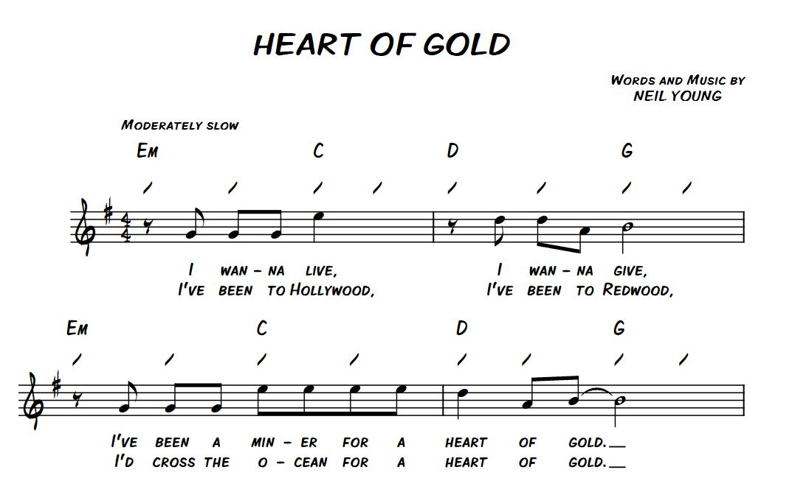

# MUSIC MADNESS
## IDD HW3 | DREW MCPHERSON NOAH PITTS JIAYANG CAO

### Overview

[Vimeo Demo](https://vimeo.com/233262710)

For Homework 3, We built a MIDI device to control a synthesizer (Mikro Prism) on the computer. We choose Neil Young's Heart of Gold as a starting point for and decided the play the chords (groups of three notes on a scale) used in that song. The chords Em, C, D, G, Bm, Am are used and all sound relatively good together.

#### Roles
Hardware: JIAYANG CAO, DREW MCPHERSON

Software: NOAH PITTS

### User Interface
When playing the MIDI controller we decided to use three photoresistor sensors to control the chord. These were layed out in a triangle pattern on the controller board. Occluding combinations of one or two of the light sensors acts like hitting the key on a traditional MIDI controller.

The timbre adjustment is done with the use of a linear pot on the side. This analog sensor can be mapped to any of the controller knobs in the Mikro Prism synthesizer software.

#### Final Prototype
The physical MIDI controller interface is made out of quarter inch birch plywood It was laser cut and assembled with wood glue. Orange acrylic was mounted behind the three hexagonal holes to provide a mounting service and diffuse light for the photo resistors. The controller incorporates three photo resistors and a linear potentiometer. The simple wiring was laid out to be discreet, fit beneath the box and only output the six wires as needed for controls.

The layout is intentionally spread out to allow for individuals with limited dexterity to play it while still keeping the triangle of hexagons close enough that one can play each series of cords by covering any two holes at the same time. Also by having a hearty wood base, the player can drum beats without fear of crushing the device.

### Electronics

#### Schematic
The circuit is pretty simple, photoresistor/potentiometer together with a 10k is in parallel with another group.

#### Final Wiring

### Code
The code is set up to read all four analog ports (A0 -A3). Three photoresistors are on analog A0 - A2, with he linear pot on A3. The three chord inputs (`alpha`, `beta`, and `gamma`) are triggered with a threshold of about 0.4v, this is just about where a hand is comfortable over the sensor window. The velocity of the new chord is set by the delta in photoresistor values between loop iterations. This is intended to give the feeling that hitting the inputs quickly sounds louder than hitting them slowly.

The linear pot maps a 7 bit integer to controller 77 in the software. Mikro Prism can then assign this controller on the computer interface.

### Reflection
We learned a lot from this exercise and have had a lot of playing music on it. None of us are musicians, and this influenced are design as we wanted to make a device that we could all play. Limiting it to a selection of chords helped a lot in not allowing it to sound like a cat walking on a piano.

Initially we had wanted to use the accelerometer, but found that the movement was somewhat unpredictable with the Pico Pro. Switching to using the photoresistors made for a more consistent experience and a device design that was playable. The single biggest challenge was getting the full pipeline of software up and running (Pico to Serial to MIDI to Virtual MIDI port to Synthesizer).
